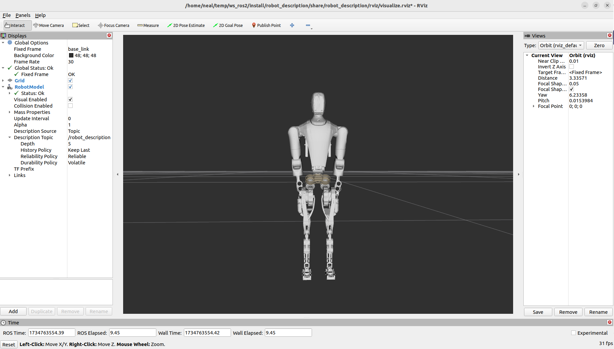
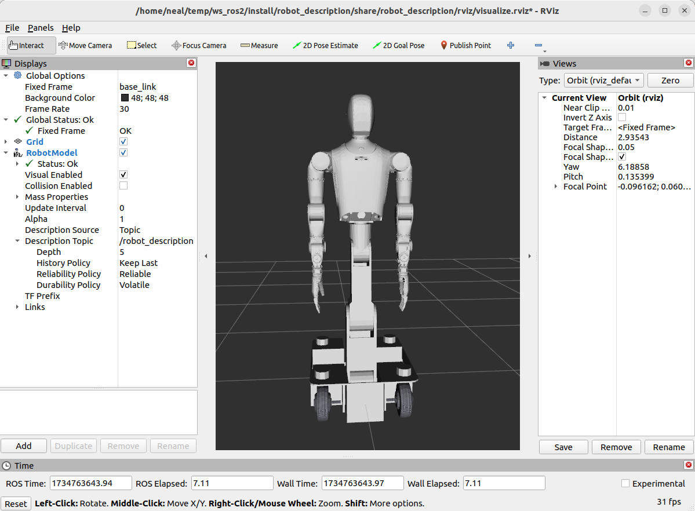
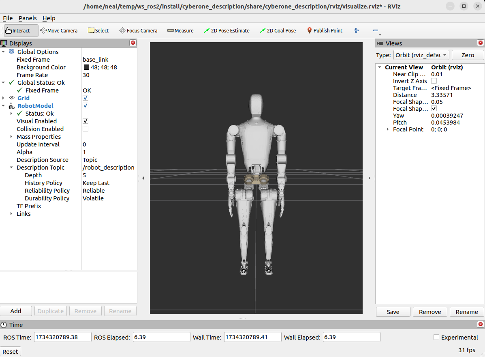
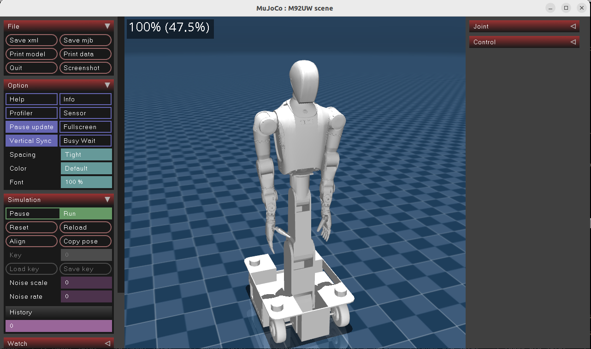
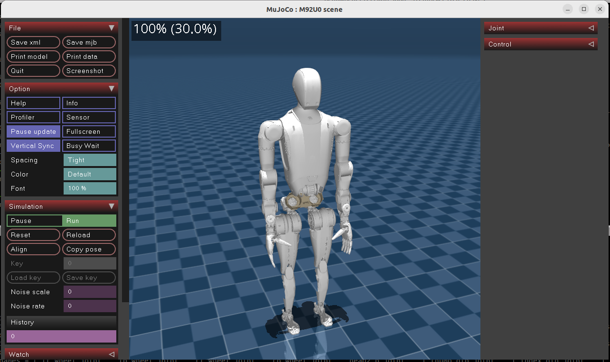

# human_description

## 依赖环境

- [ROS2 Humble](https://docs.ros.org/en/humble/index.html)
- [mujoco v3.1.6](https://github.com/google-deepmind/mujoco)

### APT 软件包

```bash
$ sudo apt ros-humble-joint-state-publisher-gui \
        ros-humble-xacro \
        ros-humble-rviz2  
```
工具脚本依赖：
- gz-math7
```bash
$ sudo apt-get update
$ sudo apt-get install lsb-release wget gnupg

$ sudo wget https://packages.osrfoundation.org/gazebo.gpg -O /usr/share/keyrings/pkgs-osrf-archive-keyring.gpg
$ echo "deb [arch=$(dpkg --print-architecture) signed-by=/usr/share/keyrings/pkgs-osrf-archive-keyring.gpg] http://packages.osrfoundation.org/gazebo/ubuntu-stable $(lsb_release -cs) main" | sudo tee /etc/apt/sources.list.d/gazebo-stable.list > /dev/null
$ sudo apt-get update

$ sudo apt install python3-gz-math7
```
## 下载
```bash
$ mkdir -p ~/ws_ros2/src
$ cd ~/ws_ros2/src
$ git clone your-project-ssh
```

## 编译

```bash
$ cd ~/ws_ros2
$ colcon build
```

## 运行

```bash
$ cd ~/ws_ros2
$ source install/setup.bash
```
### 显示机器人模型

- M92C 双足
```bash
$ ros2 launch human_description visualize_robot.launch.py robot_id:=M92C
```


- M92U 轮式
```bash
$ ros2 launch human_description visualize_robot.launch.py robot_id:=M92UW
```


- M92U 双足
```bash
$ ros2 launch human_description visualize_robot.launch.py robot_id:=M92U0
```


### Mujoco加载机器人模型
- M92U 轮式
```bash
$ simulate src/human_description/mjcf/M92UW/M92UW.scene.xml
```


- M92U 双足
```bash
$ simulate src/human_description/mjcf/M92U0/M92U0.scene.xml
```


