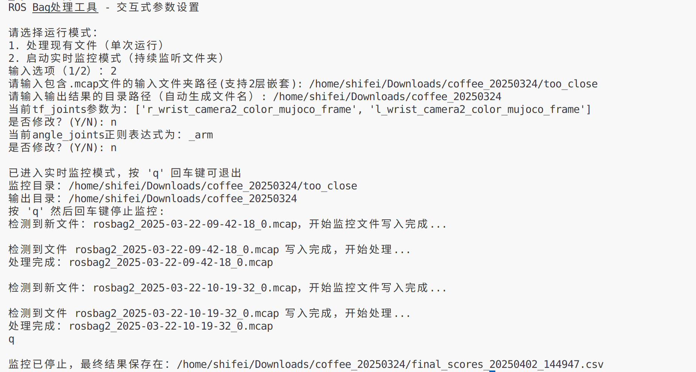

# ROS 2动态轨迹分析功能包 (`ros2bag_ana`)

## 一、功能概述
该功能包用于实时监控ROS 2的`.mcap`格式bag文件，自动解析轨迹数据并生成分析报告。主要实现以下核心功能：
1. **实时文件监控**：持续监听指定文件夹，自动处理新生成的bag文件
2. **轨迹数据解析**：提取`/tf`和`/joint_states`话题的运动学信息
3. **多维度分析**：
   - 轨迹持续时间
   - 末端执行器移动距离
   - 关节角度变化总和
4. **智能评分系统**：基于预设权重生成综合评分


## 二、核心功能模块

### 1. 文件监控模块
```python
class BagFileHandler(FileSystemEventHandler):
    def on_created(self, event):
        if event.src_path.endswith('.mcap'):
            threading.Thread(
                target=self.analyzer_node.process_bag_file,
                args=(event.src_path,)
            ).start()
```
- 使用`watchdog`库实现跨平台文件监控
- 支持递归监控子目录
- 自动检测文件写入完成状态

### 2. 数据解析模块
```python
def process_bag_file(self, bag_path):
    # 读取TF变换
    if transform.child_frame_id in self.tf_joints:
        pos = np.array([t.x, t.y, t.z])
        self.tf_distances += np.linalg.norm(pos - prev_pos)
    
    # 解析关节角度
    for name, pos in zip(joint_state.name, joint_state.position):
        if re.match(self.angle_joints_regex, name):
            self.angle_changes[name] += abs(pos - prev_angle)
```
- 支持多关节同时分析
- 自动处理坐标系变换
- 使用正则表达式匹配关节名称

### 3. 智能评分系统
```python
def calculate_score(row):
    return (
        0.7 * row['Duration_Norm'] +
        0.2 * row['End_Distance_Norm'] +
        0.1 * row['Angle_Total_Norm']
    )
```
- 基于归一化数据计算综合评分
- 可配置权重参数
- 生成百分比形式的最终评级


## 三、安装与配置

### 1. 依赖安装
```bash
sudo apt install ros-humble-rosbag2-storage-mcap
pip install -r requirements.txt
```

### 2. 构建功能包
```bash
colcon build --packages-select ros2bag_ana
source install/setup.bash
```

## 四、使用指南

### 1. 单次运行模式
```bash
ros2 run ros2bag_ana total_dynamic 
```


### 2. 实时监控模式

```bash
ros2 run ros2bag_ana total_dynamic 
```




## 五、生成文件格式


## 六、扩展功能建议
1. 添加ROS服务接口，支持动态控制监控状态
2. 集成可视化工具（如rviz）显示分析结果
3. 添加单元测试和性能分析
4. 支持ROS 2的QoS设置优化数据处理

此功能包实现了原脚本的所有功能，并遵循ROS 2最佳实践，具备更好的可维护性和扩展性。